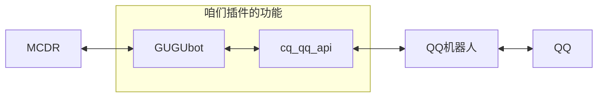

# 前置依赖

Python 包: 请确保已安装 Python™ 和 pip (pip通常在安装完python后会默认安装)。
Python 模块: 参考插件目录内的 requirements.txt 文件，使用命令 pip install -r requirements.txt 进行安装。

## 支持范围

## 前置插件

- `cq_qq_api ≥ 1.1.0`   用于连接到QQ机器人，不懂的可以去看[CQ-QQ-API](/PF-cq-api/README.md)文档
- `player_ip_logger ≥ 1.1.0`   区分真实玩家
- `online_player_api ≥ 1.0.0`   在线玩家记录
- `whitelist_api ≥ 1.3.0`   白名单管理
- `mg_events ≥ 0.2.3`   死亡消息和成就消息

请注意，**GUGUbot** 尚未支持 `mg_events ≥ 1.0.0` 的版本。

详情参考：[反馈：死亡和成就消息不可用解决方案 #162](https://github.com/LoosePrince/PF-GUGUBot/issues/162)

## 可选插件

- `PF-MCDR-WebUI ≥ 1.0.0`   提供WebUI的配置管理
